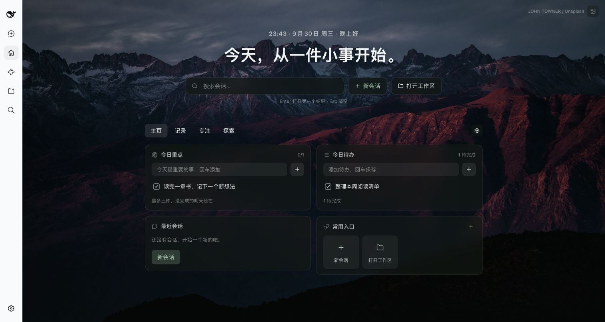
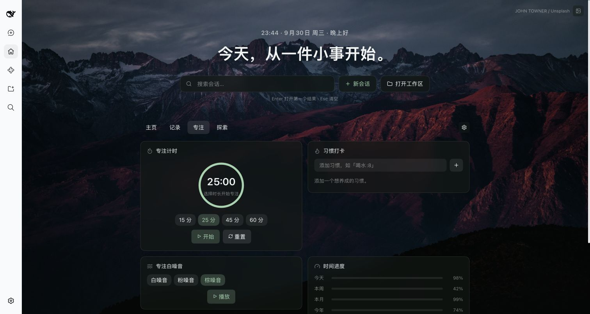

# 乔木 Home · 让 Harness 成为一天的起点

**中文** · [English](#english) · [下载安装](https://github.com/joeseesun/qiaomu-home-dsh/releases/latest) · [反馈问题](https://github.com/joeseesun/qiaomu-home-dsh/issues)

打开 Harness，先看清今天要做什么。找回上次的会话，记下三件重要的事，再给自己一段专注时间。



> 真实运行截图：DeepSeek Harness 0.2.0-rc.2，独立 Web profile；待办为演示内容。[截图说明](docs/SCREENSHOTS.md)

## 为什么装它

- **开始工作更快。** 会话搜索、最近会话和常用入口放在同一页，少一次来回翻找。
- **今天只抓住几件事。** 最多三个今日重点，加上普通待办；未完成的内容继续保留。
- **想到就记下来。** 快速记录、便签与每日一问，让零散想法有个去处。
- **进入专注状态。** 15 / 25 / 45 / 60 分钟计时，配合本地生成的白噪音、粉噪音或棕噪音。

| 页面 | 可以做什么 |
| --- | --- |
| 主页 | 搜索会话、回到最近工作、安排重点与待办、打开常用入口 |
| 记录 | 快速记录、便签、每日一问、查看活动热力图 |
| 专注 | 专注计时、习惯打卡、白噪音、时间进度、世界时钟 |
| 探索 | 多站搜索、每日一句、天气与倒计时 |



## 安装，开始第一天

需要已安装的 **DeepSeek Harness 0.2.0-rc.2** 和可用的 `dsh` CLI。插件通过预构建 Release 包分发，无需安装 Node.js 或构建源码；尚未发布 npm。

1. 打开 [v0.1.1 下载页](https://github.com/joeseesun/qiaomu-home-dsh/releases/tag/v0.1.1)，下载 `.tgz` 与同名 `.sha256` 文件。
2. 在下载目录执行：

```bash
shasum -a 256 -c qiaomu-home-dsh-0.1.1.tgz.sha256
dsh plugin --profile desktop add "$PWD/qiaomu-home-dsh-0.1.1.tgz"
```

3. 重启对应的 Harness profile，点击侧栏「主页」。写下一个今日重点，或在「专注」页开始 25 分钟计时。

`desktop` 是桌面版 profile 示例；使用 Web 或自定义 profile 时替换为实际名称。[官方插件文档](https://github.com/deepseek-ai/deepseek-harness/blob/master/docs/user/develop/basic/publish.md)

升级同样安装新版本包并重启。暂时停用可在 Harness 插件管理中禁用 Home；清除浏览器数据会丢失本地 Home 内容，操作前请导出需要的记录。

## 数据留在哪里

待办、重点、习惯、记录、便签、回答、快捷入口与页面设置保存在当前浏览器环境的 `localStorage`，键为 `dsh-qiaomu-home:v1`。目前没有跨设备同步。会话搜索使用 Harness 本地会话服务；插件没有独立账号或遥测服务。

壁纸从 Unsplash 加载并显示作者署名；网址图标会向 DuckDuckGo Icons 发送站点域名。天气在选择城市后请求 Open-Meteo；多站搜索在提交后打开目标网站。白噪音在本机生成。

## 开发与验证

```bash
git clone https://github.com/joeseesun/qiaomu-home-dsh.git
cd qiaomu-home-dsh
npm ci
npm run check
npm pack
```

Node.js 22+。`src/client/` 是界面源码，`client.js` 是需一并提交的构建产物，`index.js` 是宿主入口。`npm pack` 会重新构建并检查导出文件、bundle 和发布资料。

本轮通过 21 项自动化测试，并在独立 Harness Web profile 中完成 tgz 安装、启动、打开主页、添加重点与待办、切换专注页。移动端、其他 Harness 版本及全部小组件的长期使用尚未覆盖。完整记录见 [发布验证](docs/RELEASE-VALIDATION.md)。

## 参与与许可

这是社区插件，灵感来自 [乔木 Home for Obsidian](https://github.com/joeseesun/qiaomu-home)，并非 DeepSeek 官方项目。欢迎 [提交反馈](https://github.com/joeseesun/qiaomu-home-dsh/issues) 或按 [贡献指南](CONTRIBUTING.md) 提交 PR。源码使用 [GPL-3.0-only](LICENSE)；壁纸仍归各自作者。[安全反馈](SECURITY.md)

---

<a id="english"></a>
## English

**Make Harness your daily starting point.** Find past conversations, choose up to three priorities, capture a thought, and settle into a focus session without leaving your workspace.

The four tabs bring together Home (search, recent sessions, tasks and shortcuts), Notes (quick notes, scratchpad and daily questions), Focus (timer, locally generated noise, habits and clocks), and Explore (search, weather, quotes and countdowns). The images above are real screenshots from an isolated Harness Web profile, with demo task text.

**Install:** download the `.tgz` and `.sha256` from [v0.1.1](https://github.com/joeseesun/qiaomu-home-dsh/releases/tag/v0.1.1), verify the checksum, then run the command in the installation section. Replace `desktop` with your actual profile name. Restart Harness and open **Home**. No source build is needed; there is no npm publication.

Home data stays in this browser's `localStorage` and does not sync. Wallpapers, favicons and opt-in weather use external services; noise is generated locally. Tested with Harness 0.2.0-rc.2 on macOS: 21 automated tests plus isolated package installation and Home interactions. Mobile and other host versions are not yet verified. Community-maintained, [GPL-3.0-only](LICENSE).
