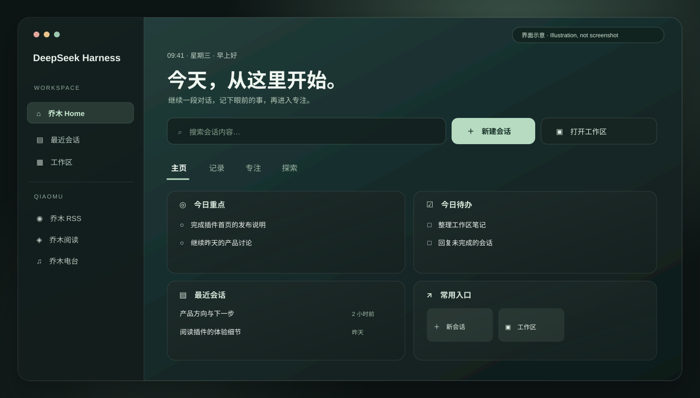
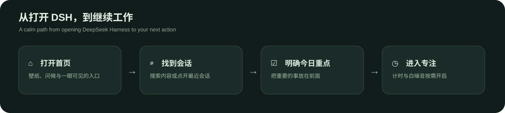

# 乔木 Home · DeepSeek Harness 起点页

**中文** · [English](#english)

每天打开 DeepSeek Harness，先看见该继续的事：找回会话、记下今日重点，然后开始工作。  
*A calm home for DeepSeek Harness: find a conversation, choose today's priorities, and get going.*

[](https://github.com/joeseesun/qiaomu-home-dsh/actions/workflows/ci.yml) [](LICENSE) [](https://github.com/joeseesun/qiaomu-home-dsh)



> **图为按当前组件结构绘制的界面示意，并非运行截图。** 本仓库提供源码与本地安装方式；尚未发布到 DSH 插件市场。当前验证包括构建、自动化测试和桌面 profile 安装，真实客户端界面仍待重启复核。

## 为什么做这个插件

DeepSeek Harness 的会话、工作区和插件入口散落在不同位置。乔木 Home 给它们一个安静的起点：常用动作放在前面，记录和专注工具按需切换。它源自 [Obsidian 版乔木 Home](https://github.com/joeseesun/qiaomu-home) 的产品思路，为 DSH 重新实现。



## 你可以做什么

| 页面 | 日常动作 | 具体能力 |
| --- | --- | --- |
| **主页** | 找回工作、确定今天要做什么 | 会话全文搜索、最近会话、最多三项今日重点、待办、常用入口 |
| **记录** | 留住临时想法 | 快速记录并复制为 Markdown、便签、每日一问、会话活动热力图 |
| **专注** | 开始一段不受打扰的工作 | 专注计时、白/粉/棕噪音、习惯打卡、时间进度、世界时钟 |
| **探索** | 查资料、看一眼外部信息 | 多站搜索、每日一句、天气、日期倒计时 |

页面顶部支持精选壁纸、每日更换和纯渐变；可自定义问候文案，并在设置中按页隐藏卡片。界面文案提供中文和英文，跟随 DSH 语言。

### 用起来是什么样

1. 从 DSH 侧栏打开 **乔木 Home**。
2. 在顶部搜索框查会话内容；按 `↑` / `↓` 选择，`Enter` 打开，`Esc` 清空。
3. 写下最多三件今日重点。未完成的重点会结转到第二天。
4. 需要专注时切到「专注」，选 15 / 25 / 45 / 60 分钟计时。

## 安装

**前提：** 已安装 DeepSeek Harness，且可以在本地 profile 中安装 bundle。这个仓库是源码仓库，不是 npm 发布包。

```bash
git clone https://github.com/joeseesun/qiaomu-home-dsh.git
cd qiaomu-home-dsh
npm ci
npm run build
npm test
```

随后在 DSH 的插件管理工具中使用 `install_bundle`，把 `target` 指向**克隆目录的绝对路径**，再重启 DSH。安装成功后，侧栏应出现「乔木 Home」入口。不要把下面的工具调用示意当成终端命令：

```text
plugin_manager install_bundle
  target=/absolute/path/to/qiaomu-home-dsh
```

<details>
<summary>手动配置本地 desktop profile</summary>

在 profile 的 `package.json` 中，将 `qiaomu-home-dsh` 加入 `dsh.profile.bundles`，并加入依赖：

```json
{
  "dependencies": {
    "qiaomu-home-dsh": "file:/absolute/path/to/qiaomu-home-dsh"
  }
}
```

在该 profile 目录执行 `pnpm install`，然后重启 DSH。若采用此方式，请确认 profile 的插件配置启用了 `qiaomu-home`。路径需按你的机器修改。

</details>

## 数据与联网边界

- 待办、重点、习惯、记录、便签、回答、快捷入口和页面设置保存在当前 DSH 浏览器环境的 `localStorage`，键为 `dsh-qiaomu-home:v1`。包名调整后仍沿用此键，以保留已有数据；这些内容目前不会自动同步到其他设备或工作区。
- 会话搜索使用 DSH 的本地会话服务；本插件不提供账号或遥测。
- 选择壁纸时，图片从 `images.unsplash.com` 加载，并在界面显示摄影师署名。快捷网址的图标来自 `icons.duckduckgo.com`，会向该服务发送站点域名。
- 天气仅在选择城市后请求 `api.open-meteo.com`；多站搜索仅在用户提交时打开目标网站。白噪音在本机生成。

## 开发与验证

```bash
npm ci
npm run build  # 生成并自检 client.js
npm test       # 纯逻辑、组件渲染和插件注册测试
```

`client.js` 是 DSH 加载的构建产物，应与源码一起提交。`index.js` 是宿主入口；`src/client/` 包含页面、卡片、状态、字典和样式；`cordis.patch.yml` 声明宿主插件行。CI 在 pull request 和 `main` 推送时运行构建与测试。

**验证范围：** 源码在本地通过构建和 21 项测试；桌面 profile 已安装本地包。真实 DSH 客户端中的入口、截图、交互和重启后的加载尚未作为本仓库的发布证据。移动端和跨设备同步未验证。

## 参与和许可

欢迎通过 [Issues](https://github.com/joeseesun/qiaomu-home-dsh/issues) 反馈真实工作流中的问题。代码贡献请看 [CONTRIBUTING.md](CONTRIBUTING.md)，安全问题请看 [SECURITY.md](SECURITY.md)。

本项目采用 [GPL-3.0-only](LICENSE)，与 Obsidian 版一致。精选壁纸通过 Unsplash 图片地址加载，图片仍受各自作者及平台条款约束。

---

<a id="english"></a>
## English

**Qiaomu Home** brings a quiet starting point to DeepSeek Harness. Search past conversations, reopen recent work, choose up to three priorities for today, and start a focus session when you are ready. It is a DSH implementation inspired by [Qiaomu Home for Obsidian](https://github.com/joeseesun/qiaomu-home).

The illustration above follows the current component layout; **it is not a runtime screenshot**. This is a source repository, not a DSH marketplace listing or an npm release.

| Tab | What it helps you do |
| --- | --- |
| Home | Search conversations, reopen recent sessions, manage priorities and tasks, launch frequent actions |
| Notes | Capture quick notes, edit a scratchpad, answer a daily question, inspect session activity |
| Focus | Use a timer, locally generated ambient noise, habits, progress bars, and world clocks |
| Explore | Open web searches, check weather, read a quote, and track a date countdown |

### Install from source

You need a local DeepSeek Harness profile that supports bundles. Clone this repository, then run:

```bash
npm ci
npm run build
npm test
```

In DSH, ask its plugin manager to run `install_bundle` with the clone's absolute path as `target`, then restart DSH. The sidebar should show **Qiaomu Home**. The expandable manual-profile example above is another option.

### Privacy and verification

Personal Home data stays in this DSH browser environment's `localStorage` under the retained key `dsh-qiaomu-home:v1`; it does not sync across devices or workspaces. Conversation search uses DSH's local service. Wallpapers contact Unsplash, shortcut favicons contact DuckDuckGo Icons, and weather contacts Open-Meteo only after choosing a city. External searches open only when submitted. Ambient noise is generated locally.

Local verification covers the build, 21 automated tests, and installation into a desktop profile. A fresh in-app reload, real screenshot, and mobile behavior remain unverified. See [Contributing](CONTRIBUTING.md), [Security](SECURITY.md), and the [GPL-3.0-only license](LICENSE).
